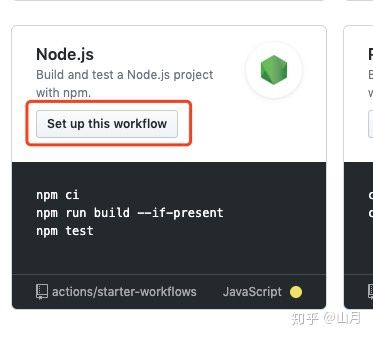
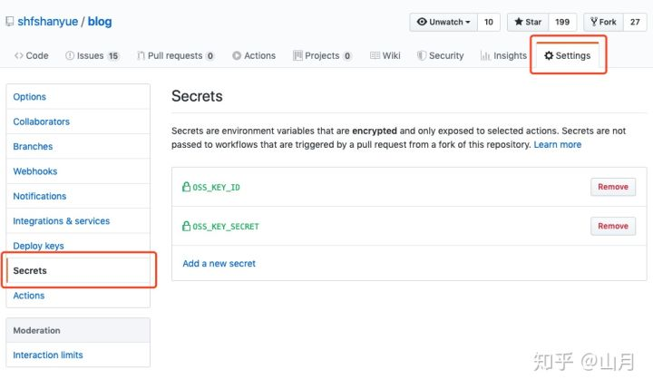

# 快速开始

如果你是一个前端项目，可以使用 `Node.js` 的模板，点击 `Set up this workflow`



此时生成了一个文件 `.github/workflows/nodejs.yaml`，修改内容如下

```text
name: Git Action Test
# on: 用来指定启动触发的事件，push 则表示在监听到 git push 到指定分支时触发。如此之外还可以是 pull_request。
on: [push]   

#jobs:一个 CI/CD 的工作流有许多 jobs 组成，比如最典型的 job 是 lint，test，build 或者 deploy。
#所有的 job 都是并行的,如果想顺序执行，可以这样 build-job: needs: test-job。
jobs:         
  build:
	#runs-on用来指定执行系统环境，不仅有常用的 Linux 发行版，还可以是 macOS 或 Windows。
    runs-on: ubuntu-latest  
 	# steps 表示每个 job 需要执行的步骤，比如这里我分成了四步：拉取分支 → 安装 Node 环境 → 构建项目 → 上传 COS。
    steps:  
    #Action 是组成工作流最核心最基础的元素。每个 Action 可以看作封装的独立脚本，有自己的操作逻辑，我们只需要 uses 并通过 with 传入参数即可。
    - uses: actions/checkout@v1 
    - name: Use Node.js 10.x
      uses: actions/setup-node@v1
      with:
        node-version: 10.x
    - name: npm install, build
      run: |
        npm install
        npm run build --if-present
      env:
        CI: true
```

执行 `git push` 操作，此时可以在 `github` 的 `Actions` 标签页看到执行结果


# 安全相关

如何在 `github action` 上访问敏感数据？如使用 `ssh` 登录时如何维护密码。

我们可以在 github repo 上依次点击 `Settings` -> `Secrets` 设置 `secret`



```text
- name: setup aliyun oss
  uses: manyuanrong/setup-ossutil@master
  with:
    endpoint: oss-cn-beijing.aliyuncs.com
    access-key-id: ${{ secrets.OSS_KEY_ID }}
    access-key-secret: ${{ secrets.OSS_KEY_SECRET }}
```

这里的 `secret` 就是一种 `context`，描述 CI/CD 一个 `workflow` 中的上下文信息，使用 `${{ expression }}` 语法表示。除了 `secret`，还有

- `github`: `workflow` 的信息，如 `github.sha` 可以获取当前的 `commit SHA`，我们可以利用它为 `sentry` 或者 `docker image` 打入版本号
- `env`: 环境变量
- `job`: 当前执行 `job` 的信息，如 `job.status` 表示当前 `job` 的执行状态
- `matrix`: 描述一些构建信息，如 `node` 以及 `os` 版本号

更多 `context` 信息可以参考官方文档 **Contexts and expression syntax for GitHub Actions[4]**


# 自动创建项目Release

有些项目在发布新版本时，一般都会创建一个`Github Release`，并且把对应编译好之后的文件上传到`Release`的资源列表中，例如：


如果这个使用手动操作的话，不仅步骤重复又繁琐(每次都要编译出各个操作系统对应的发行包再进行上传)，而且最蛋疼的是对于国内的网络环境来说，上传文件速度简直不能忍，好不容易上传了一大半搞不好就因为网络原因又要重新上传，相信用过的人都深有体会。

我就在想如果能用`Github Actions`来创建`Release`,并且做对应的编译和上传，那上面的问题都可以迎刃而解了，于是在官方市场搜索了一下`Release`关键字，果然已经有提供对应的`actions`了：

*   [create\-release](https://github.com/actions/create-release): 用于创建 release
*   [upload\-release\-asset](https://github.com/actions/upload-release-asset): 用于上传资源到对应的 release 中

接着创建一个`Github仓库`，我测试的仓库地址是[https://github.com/monkeyWie/github\-actions\-demo](https://github.com/monkeyWie/github-actions-demo)，项目用 go 语言写的，代码非常简单就是两个 hello world 级别的代码，里面包含了普通的 go 程序和 cgo 程序。

项目的构建流程是在项目`git push --tags`的时候，触发 workflow，通过`Github Actions`编译出来`Windows、Linux、macOS`三个操作系统对应的 64 位可执行文件，再根据`tag name`和`tag message`来创建对应的`Github Release`，并将编译好的文件上传。

同样的创建一个`.github/workflows/main.yml`文件，内容如下：

```
name: CI

on:
  push:
    # Sequence of patterns matched against refs/tags
    tags:
      - "v*" # Push events to matching v*, i.e. v1.0, v20.15.10
jobs:
  build:
    runs-on: ubuntu-latest

    steps:
      - name: Checkout source
        uses: actions/checkout@v1
      - name: Use Golang
        uses: actions/setup-go@v1
        with:
          go-version: "1.13.x"
      - name: Build normal
        run: |
          CGO_ENABLED=0 GOOS=windows GOARCH=amd64 go build -o normal-windows-x64.exe cmd/normal/main.go
          CGO_ENABLED=0 GOOS=linux GOARCH=amd64 go build -o normal-linux-x64 cmd/normal/main.go
          CGO_ENABLED=0 GOOS=darwin GOARCH=amd64 go build -o normal-darwin-x64 cmd/normal/main.go
          zip normal-windows-x64.zip normal-windows-x64.exe
          zip normal-linux-x64.zip normal-linux-x64
          zip normal-darwin-x64.zip normal-darwin-x64
      - name: Build cgo
        run: |
          go get github.com/monkeyWie/xgo
          ~/go/bin/xgo -targets=windows/amd64,linux/amd64,darwin/amd64 -ldflags="-w -s" -pkg=cmd/cgo/main.go -out=cgo .
          mv cgo-windows-* cgo-windows-x64.exe
          mv cgo-linux-* cgo-linux-x64
          mv cgo-darwin-* cgo-darwin-x64
          zip cgo-windows-x64.zip cgo-windows-x64.exe
          zip cgo-linux-x64.zip cgo-linux-x64
          zip cgo-darwin-x64.zip cgo-darwin-x64
      - name: Create Release
        id: create_release
        uses: monkeyWie/create-release@master
        env:
          GITHUB_TOKEN: ${{ secrets.GITHUB_TOKEN }}
        with:
          tag_name: ${{ github.ref }}
          release_name: Release ${{ github.ref }}
          draft: false
          prerelease: false

      - name: Upload Release normal windows
        uses: actions/upload-release-asset@v1.0.1
        env:
          GITHUB_TOKEN: ${{ secrets.GITHUB_TOKEN }}
        with:
          upload_url: ${{ steps.create_release.outputs.upload_url }} # This pulls from the CREATE RELEASE step above, referencing it's ID to get its outputs object, which include a `upload_url`. See this blog post for more info: https://jasonet.co/posts/new-features-of-github-actions/#passing-data-to-future-steps
          asset_path: ./normal-windows-x64.zip
          asset_name: normal-${{ steps.create_release.outputs.tag }}-windows-x64.zip
          asset_content_type: application/zip
      - name: Upload Release normal linux
        uses: actions/upload-release-asset@v1.0.1
        env:
          GITHUB_TOKEN: ${{ secrets.GITHUB_TOKEN }}
        with:
          upload_url: ${{ steps.create_release.outputs.upload_url }} # This pulls from the CREATE RELEASE step above, referencing it's ID to get its outputs object, which include a `upload_url`. See this blog post for more info: https://jasonet.co/posts/new-features-of-github-actions/#passing-data-to-future-steps
          asset_path: ./normal-linux-x64.zip
          asset_name: normal-${{ steps.create_release.outputs.tag }}-linux-x64.zip
          asset_content_type: application/zip
      - name: Upload Release normal darwin
        uses: actions/upload-release-asset@v1.0.1
        env:
          GITHUB_TOKEN: ${{ secrets.GITHUB_TOKEN }}
        with:
          upload_url: ${{ steps.create_release.outputs.upload_url }} # This pulls from the CREATE RELEASE step above, referencing it's ID to get its outputs object, which include a `upload_url`. See this blog post for more info: https://jasonet.co/posts/new-features-of-github-actions/#passing-data-to-future-steps
          asset_path: ./normal-darwin-x64.zip
          asset_name: normal-${{ steps.create_release.outputs.tag }}-darwin-x64.zip
          asset_content_type: application/zip

      - name: Upload Release cgo windows
        uses: actions/upload-release-asset@v1.0.1
        env:
          GITHUB_TOKEN: ${{ secrets.GITHUB_TOKEN }}
        with:
          upload_url: ${{ steps.create_release.outputs.upload_url }} # This pulls from the CREATE RELEASE step above, referencing it's ID to get its outputs object, which include a `upload_url`. See this blog post for more info: https://jasonet.co/posts/new-features-of-github-actions/#passing-data-to-future-steps
          asset_path: ./cgo-windows-x64.zip
          asset_name: cgo-${{ steps.create_release.outputs.tag }}-windows-x64.zip
          asset_content_type: application/zip
      - name: Upload Release cgo linux
        uses: actions/upload-release-asset@v1.0.1
        env:
          GITHUB_TOKEN: ${{ secrets.GITHUB_TOKEN }}
        with:
          upload_url: ${{ steps.create_release.outputs.upload_url }} # This pulls from the CREATE RELEASE step above, referencing it's ID to get its outputs object, which include a `upload_url`. See this blog post for more info: https://jasonet.co/posts/new-features-of-github-actions/#passing-data-to-future-steps
          asset_path: ./cgo-linux-x64.zip
          asset_name: cgo-${{ steps.create_release.outputs.tag }}-linux-x64.zip
          asset_content_type: application/zip
      - name: Upload Release cgo darwin
        uses: actions/upload-release-asset@v1.0.1
        env:
          GITHUB_TOKEN: ${{ secrets.GITHUB_TOKEN }}
        with:
          upload_url: ${{ steps.create_release.outputs.upload_url }} # This pulls from the CREATE RELEASE step above, referencing it's ID to get its outputs object, which include a `upload_url`. See this blog post for more info: https://jasonet.co/posts/new-features-of-github-actions/#passing-data-to-future-steps
          asset_path: ./cgo-darwin-x64.zip
          asset_name: cgo-${{ steps.create_release.outputs.tag }}-darwin-x64.zip
          asset_content_type: application/zip
```

构建流程如下：

1.  监听 tag name 为`v`开头的 push
2.  运行一个 job，在`ubuntu`虚拟机环境下
3.  拉取源码，安装`golang 1.13.x`环境
4.  使用`go build`交叉编译出不同操作系统下 64 位可执行文件，并使用 zip 压缩
5.  使用`xgo`交叉编译出不同操作系统下 64 位可执行文件，并使用 zip 压缩
6.  使用`monkeyWie/create-release@master`创建 Release，其中会用到`${{ secrets.GITHUB_TOKEN }}`，这是`Github Actions`内置的一个[秘钥](https://help.github.com/en/github/automating-your-workflow-with-github-actions/virtual-environments-for-github-actions#github_token-secret)，用于授权访问你自己的 github 存储库，原理就是使用这个`TOKEN`调用`Github API`来进行创建 release，还有一个`${{ github.ref }}`也是`Github Actions`内置的一个[变量](https://help.github.com/en/github/automating-your-workflow-with-github-actions/contexts-and-expression-syntax-for-github-actions#github-context)，然后通过 action 的`with`进行参数传递。
7.  使用`actions/upload-release-asset@v1.0.1`上传文件，这里使用了两个表达式`${{ steps.create_release.outputs.upload_url }}`和`${{ steps.create_release.outputs.tag }}`，可以获取到指定`action`的输出，第一个是获取创建好的 release 对应的上传地址，第二个是获取对应的 tag(例如：v1.0.0)，这样就可以在把上传的文件带上版本号。因为这个`action`不支持多个文件上传，所以就写了多个 action 进行上传。


   


# 市场

https://github.com/marketplace

https://docs.github.com/cn/actions/configuring-and-managing-workflows/using-environment-variables