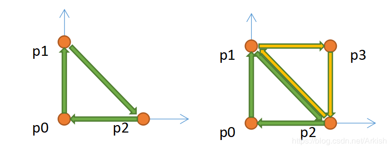
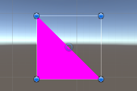
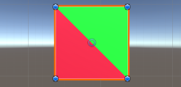
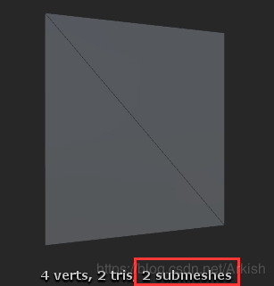

# 基本概念

- **Meshes** 是Unity的主要图形基元。 它们定义对象的形状。
- **Materials** 通过包含对所用纹理的引用、平铺信息、颜色色调等来定义表面应使用的渲染方式。材质的可用选项取决于材质使用的着色器。
- **Shaders** 是一些包含数学计算和算法的小脚本，根据光照输入和材质配置来计算每个像素渲染的颜色。
- **Textures** 是位图图像。材质可包含对纹理的引用，因此材质的着色器可在计算游戏对象的表面颜色时使用纹理。除了游戏对象表面的基本颜色（反照率）之外，纹理还可表示材质表面的许多其他方面，例如其反射率或粗糙度。


## Texture 


- [Default](https://docs.unity3d.com/Manual/TextureTypes.html#Default)
- [Normal Map](https://docs.unity3d.com/Manual/TextureTypes.html#NormalMap) 法线贴图就是在原物体的凹凸表面的每个点上均作法线，通过RGB颜色通道来标记法线的方向，你可以把它理解成与原凹凸表面平行的另一个不同的表面，但实际上它又只是一个光滑的平面
- [Editor GUI and Legacy](https://docs.unity3d.com/Manual/TextureTypes.html#Editor) 
- [Sprite (2D and UI)](https://docs.unity3d.com/Manual/TextureTypes.html#Sprite)
- [Cursor](https://docs.unity3d.com/Manual/TextureTypes.html#Cursor)  光标文件
- [Cookie](https://docs.unity3d.com/Manual/TextureTypes.html#Cookie) 聚光灯贴图
- [Lightmap](https://docs.unity3d.com/Manual/TextureTypes.html#Lightmap)  光照贴图
- [Single Channel](https://docs.unity3d.com/Manual/TextureTypes.html#SingleChannel)


# Mesh

- 顶点坐标（vertex） 顶点坐标数组存放Mesh的每个顶点的空间坐标，假设某mesh有n个顶点，则vertex的size为n
- 三角形序列（triangle） 每个mesh都由若干个三角形组成，而三角形的三个点就是顶点坐标里的点，三角形的数组的size = 三角形个数 * 3.
- 法线（normal） 法线数组存放mesh每个顶点的法线，大小与顶点坐标对应，normal[i]对应顶点vertex[i]的法线.它不仅说明了`面片的朝向，还可用于计算光照模型`。
- 次法线 (subnormal)
- 纹理坐标（uv） 它定义了图片上每个点的位置的信息. 这些点与3D模型是相互联系的, 以决定表面纹理贴图的位置. UV就是将[图像](http://baike.baidu.com/view/42116.htm)上每一个点精确对应到模型物体的表面. uv[i]对应vertex[i]
- 切线 (tangent) 切线是垂直于法线的一条向量，由于垂直于法线的向量有无数条，所以切线最终规定为由UV坐标来决定朝向。

例如：左图利用三个点绘制了一个三角形，而右图则通过两个三角形得到了一个四边形：



注：这里需要注意的是，很明显从左图中给定的三个点，有两种方式可以得到三角图元，即

- 顺时针旋转（也称左手螺旋）：p0->p1->p2
- 逆时针旋转（右手螺旋）：p0->p2->p1

它们的区别在哪里呢？类似于物理中左右手判断法则，拇指指示了三角图元的法线方向。法线其中一个作用是指明了三角图元的方向，如果从反方向看的话，这个图元是不可见的。而unity3d是左手坐标系在渲染时默认只渲染正面，背面是看不见的。

那么要绘制上图中的三角形，即问题在于表达三个点的坐标，也就可以表示为下面的代码：

```
Vector2[] vertices = new Vector2[]{ 
	new Vector2( 0, 0 ),							// p0
	new Vector2( 0, 1 ),							// p1
	new Vector2( 1, 0 ),							// p2
 };
```

而如果要绘制四边形，也就需要六个点的坐标，如下面所示：

```
Vector2[] vertices = new Vector2[]{ 
	// 三角图元 0
	new Vector2( 0, 0 ),							// p0
	new Vector2( 0, 1 ),							// p1
	new Vector2( 1, 0 ),							// p2
	// 三角图元 1
	new Vector2( 0, 1 ),							// p1
	new Vector2( 1, 1 ),							// p3
	new Vector2( 1, 0 ),							// p2
 };
```

如果单纯使用顶点来表示（绘制）图形，是非常直观的——因为我们知道每一个顶点的位置信息，并且知道每三个点构成一个三角图元。然而从上面绘制四边形的数据中可以发现，三角图元1中有两个顶点的位置信息（p1和p3）和三角图元0是一样的。这也就增加了一些开销。

总而言之，这个额外的存储开销是完全可以去除的，方法就是使用索引（Indices）。

```
Vector2[] vertices = new Vector2[]{ 
	new Vector2( 0, 0 ),							// p0
	new Vector2( 0, 1 ),							// p1
	new Vector2( 1, 0 ),							// p2
 };
 int[] indices = new indices[]{
 	0, 1, 2											// 表示 0->1->2 构成一个三角图元
 };
```

没错，indices就是这么一回事，原来是vertices数组中，每三个顶点表示一个三角图元，现在是indices数组中，每三个整型表示一个图元。这些整形不存储真正的数据，`只有用到时才从vertices中取出，也就是所谓的索引了`。


# SubMesh

面提到过，MeshRenderer负责对MeshFilter中的Mesh进行绘制，而绘制依赖于着色器，或者说着色器生成的材质（Material）。简单来说，材质具体描述了Mesh中的数据如何进行绘制。
Material只负责一个Mesh的一次绘制，但是现在有一个要求是，Mesh的不同部分，要求使用不同的材质。例如上面所绘制的四边形，两个三角面片要求绘制出不同的颜色。这个时候就需要使用SubMesh了。
从名字也能看出，SubMesh类似于Mesh，并且Mesh包含SubMesh。但是和Mesh不一样的是，SubMesh只有triangles信息，也就是说SubMesh使用自身的 triangles信息，索引找到 Mesh上的顶点信息（如vertices、 uv、normal等）后进行三角面片的绘制。它们的关系如下图所示：


这个设置的过程依赖于Mesh中的API是 SetTriangles，其函数原型为：

```
/*
 @parm triangles: 			SubMesh的triangles
 @parm submesh: 			属于Mesh中的第几个submesh
 @parm calculateBounds：	是否计算包围盒，默认为true。设置为false会使用当前存在的包围盒以减少CPU开销
 @parm baseVertex：			triangles中每一个元素的偏移值，默认为0；
*/
public void SetTriangles(int[] triangles, int submesh, bool calculateBounds = true, int baseVertex = 0);

```

用法如下：

```
Vector3[] vertices = new Vector3[]{
	     new Vector3( 0, 0, 0 ),
	     new Vector3( 0, 1, 0 ),
	     new Vector3( 1, 0, 0 ),
	     new Vector3( 1, 1, 0 ),
	};
	int[] subTriangles_0 = new int[]{
		0, 1, 2
	};
	int[] subTriangles_1 = new int[]{
		1, 3, 2
	};
	Mesh mesh = new Mesh();
	mesh.vertices = vertices;
	// 告诉 Mesh它将会有两个SubMesh
	mesh.subMeshCount = 2;
	mesh.SetTriangles( subTriangles_0 , 0 );
	mesh.SetTriangles( subTriangles_1 , 1 );
	// 重新计算normal信息，不然后面的 material会不起作用
	mesh.RecaculateNormals();
	// MeshFilter
	MeshFilter meshFilter = GetComponent<MeshFilter>();
	if( meshFilter == null ) meshFilter = gameObject.AddComponent<MeshFilter>();
	meshFilter.mesh = mesh;
	// MeshRenderer
	MeshRenderer meshRenderer = GetComponent<MeshRenderer>();
	if( meshRenderer == null ) gameObject.AddComponent<MeshRenderer>();
```

将上述代码挂载到一个空节点上运行，可以得到以下结果：



嗯？！难不成笔者在骗人，这里明明只有一个三角面片。莫慌，之前不是说过，要求两个三角面片使用不同的材质吗？如果运行时，将MeshRenderer的Material的Size设为2的话，你会发现另外一个三角图元也出现了：


也就是说，有多少个SubMesh，就需要有多少个Material，并且它们的绘制关系是一一对应的。即第一个SubMesh使用第一个
Material绘制，第二个SubMesh使用第二个Material绘制，以此类推。为了验证这个，接下来创建两个默认的Material，将它们的Albedo分别设置为红色和绿色，接着运行时将这两个 Material赋给MeshRenderer，将会得到如下图所示的运行结果：



另外，如果双击 MeshFilter的 Mesh属性，从下面的预览窗口，也能看到这个Mesh有两个SubMesh：




> 如何在unity显示线框图
> 选择场景视图在其工具栏左侧的显示模式。前三个选项是阴影线框和阴影线框。


# MeshCombine

MeshCombine，就是合并网格。

为什么好好的模型要进行网格的合并呢？

如果从应用的角度来看的话，通过网格合并可以实现游戏中的换装，你可能会说，更换的服装例如帽子好好的，为什么要合并到人物模型上？

问题在于，如果游戏中不是所有人物模型都是标准的人型呢？例如魔兽世界中，不同种族的头部模型大小是不一致的，很容易出现穿模。当然可以同一顶帽子制作适配于不同种族的模型，反正这个工作是美术做的（溜）。但是从整体出发的话，这样做无疑增加了游戏容量的大小，也会减慢游戏开发的进度，同时一定程度上影响代码的简洁性。

但是通过网格合并，将帽子的网格合并到人物模型上，并且蒙皮至人物头部的骨骼上。这样以后，由于骨骼的大小、旋转、位移信息会影响顶点，因此一旦这个帽子戴到别的人物模型身上时，由于它们头部骨骼的大小不一样，那么帽子也会自动变大。也就达到了同一个模型，适用于多个人物模型的目的。
（关于骨骼、蒙皮、骨骼蒙皮动画，可以参考下面的扩展资料）

关于网格合并，同样Unity在 Mesh提供了相关的API：

```
/*
 @parm combine: 			要进行合并的CombineInstance实例
 @parm mergeSubMeshes: 		是否将SubMesh进行合并，true为将SubMesh进行合并，false表示以SubMesh的形式存在
 @parm useMatrices: 		是否应用定义在CombineInstance中的transform信息
 @hashLightmapData: 		如果为true，则应用CombineInstance中的lightmapScaleOffset对mesh中的lightmapUV进行偏移
*/
public void CombineMeshes(CombineInstance[] combine, bool mergeSubMeshes = true, bool useMatrices = true, bool hasLightmapData = false);
```

要使用它也很简单，如下面的代码所示：

```
 // 收集要合并的物体的所有Mesh信息
        MeshFilter[] childMeshFilters = GetComponentsInChildren<MeshFilter>();

        CombineInstance[] destCombineInstances = new CombineInstance[childMeshFilters.Length];
        for ( int i = 0; i < childMeshFilters.Length; i++)
        {
            destCombineInstances[i] = new CombineInstance();
            destCombineInstances[i].mesh = childMeshFilters[i].mesh;
            destCombineInstances[i].transform = childMeshFilters[i].transform.localToWorldMatrix;

            // 隐藏子物体，或者Destory
            childMeshFilters[i].gameObject.SetActive(false);
        }
        Mesh destMesh = new Mesh();
        // 进行合并
        destMesh.CombineMeshes(destCombineInstances, true);
        destMesh.RecalculateNormals();

        // 将合并后的mesh赋给当前的MeshFilter
        MeshFilter meshFilter = GetComponent<MeshFilter>();
        if (meshFilter == null) meshFilter = gameObject.AddComponent<MeshFilter>();
        meshFilter.mesh = destMesh;

        MeshRenderer meshRenderer = GetComponent<MeshRenderer>();
        if( meshRenderer == null)
        {
            meshRenderer = gameObject.AddComponent<MeshRenderer>();
            // 设置MeshRenderer的material
            Material material = new Material(Shader.Find("Standard"));
            meshRenderer.material = material;
        }
```


# 相关链接

- https://zhuanlan.zhihu.com/p/96084686
- https://docs.unity.cn/cn/2018.4/Manual/class-Mesh.html
- https://docs.unity.cn/cn/2020.1/Manual/Shaders.html
- https://learnopengl-cn.github.io/
- https://blog.csdn.net/Arkish/article/details/98482430
- https://blog.csdn.net/tw_345/article/details/79771454
- https://zhuanlan.zhihu.com/p/96084686
- https://blog.csdn.net/ecidevilin/category_9266800.html